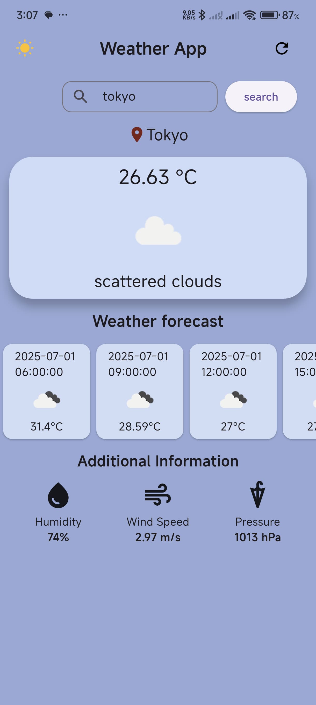
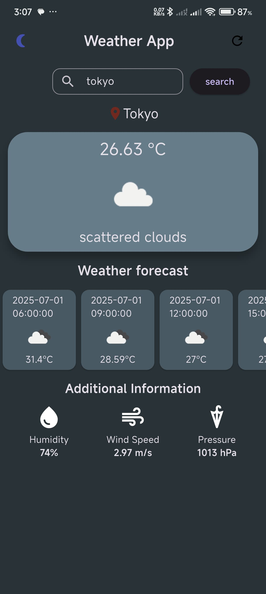

# 🌤️ Weather App

A simple Flutter weather application that shows real-time weather conditions and forecasts for any city. Built using clean UI and core Flutter concepts.

## 🚀 Features

- 🔍 **City Search** – Enter a city name to view current weather details.
- 📍 **Current Location Weather** – Automatically fetches weather data based on user location when app opens.
- ♻️ **Reload Option** – Easily refresh weather data with a reload button.
- 🌗 **Theme Switcher** – Switch between dark and light modes.
- ❗ **Error Handling** – Handles invalid city names and no internet connection smoothly.

## 🛠️ Tech Stack

- **Flutter** (no external state management used – only `setState`)
- Weather data via API (OpenWeatherMap)
- Dart `http`, `location`, and `intl` packages
- Custom light/dark theming

## 📱 Screenshots

### 🌤 Home Screen (Light & Dark)
 


## 📂 Folder Structure

- `lib/` – Main application code
  - `main.dart`
  - `buildweather.dart`
  - `weatherfront.dart`
  - `currentcity.dart`
- `assets/` – Icons and image assets

## 📦 Getting Started

To run the app:

```bash
flutter pub get
flutter run
